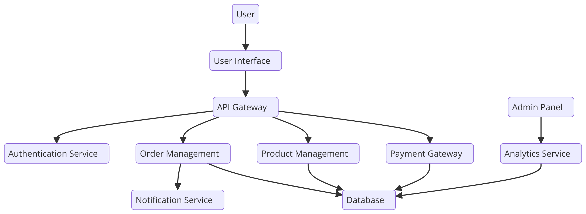

# E-Commerce Platform

## Table of Contents

- [E-Commerce Platform](#e-commerce-platform)
  - [Table of Contents](#table-of-contents)
  - [Project Overview](#project-overview)
  - [Features](#features)
  - [Technologies Used](#technologies-used)
    - [Other Tools and Technologies](#other-tools-and-technologies)
  - [Architecture](#architecture)
  - [Installation](#installation)
    - [Prerequisites](#prerequisites)
    - [Backend Setup](#backend-setup)
    - [Frontend Setup](#frontend-setup)
  - [Usage](#usage)
  - [Contributing](#contributing)
  - [License](#license)
  - [Contact](#contact)

## Project Overview

The E-Commerce Platform is a comprehensive online shopping solution built with .NET 8 for the backend and Angular for the frontend. This project aims to provide a scalable, secure, and user-friendly platform for online retailers to manage their products, orders, and customers.

## Features

- User authentication and authorization
- Product management (CRUD operations)
- Shopping cart functionality
- Order processing and management
- Customer profile management
- Payment gateway integration
- Responsive design for mobile and desktop

## Technologies Used

- **.NET Framework/Core**
- **Entity Framework**
- **SQL Server**
- **ASP.NET MVC/Web API**
- **Bootstrap/CSS**
- **JavaScript/TypeScript**

### Other Tools and Technologies

- Docker
- Jenkins (CI/CD)
- AWS (Hosting and Deployment)
- Swagger (API Documentation)

## Architecture

The platform follows a microservices architecture with a clear separation of concerns between the frontend and backend. The backend provides RESTful APIs consumed by the Angular frontend.

## Installation

### Prerequisites

- .NET 8.0
- Node.js 14+
- Angular CLI
- Docker

### Backend Setup

1. Clone the repository:
   \`\`\`bash
   git clone https://github.com/vongovantien/VNVTStoreApp.git
   \`\`\`
2. Navigate to the project directory
   \`\`\`bash
   cd VNVTStoreApp
   \`\`\`
3. Restore the dependencies:
   \`\`\`bash
   dotnet restore
   \`\`\`
4. Run the application:
   Update the database connection string in appsettings.json

   Apply the migrations to your database

   dotnet ef database update

   dotnet run

### Frontend Setup

1. Clone the repository:
   \`\`\`bash
   git clone https://github.com/vongovantien/VNVTStoreApp.git
   \`\`\`
2. Navigate to the frontend directory:
   \`\`\`bash
   cd ShopApp
   \`\`\`
3. Install dependencies:
   \`\`\`bash
   npm install
   \`\`\`
4. Run the application:
   \`\`\`bash
   ng serve
   \`\`\`

## Usage

Open your browser and navigate to http://localhost:5000
Use the application interface to manage inventory, process sales, and manage customers.

## Contributing

We welcome contributions from the community. Please follow these steps to contribute:

1. Fork the repository.
2. Create a new branch (\`git checkout -b feature-branch\`).
3. Make your changes.
4. Commit your changes (\`git commit -m 'Add new feature'\`).
5. Push to the branch (\`git push origin feature-branch\`).
6. Open a Pull Request.

## License

This project is licensed under the MIT License - see the [LICENSE](LICENSE) file for details.

## Contact

For any inquiries or feedback, please contact us at:

- Email:vongovantien@gmail.com
- GitHub:
